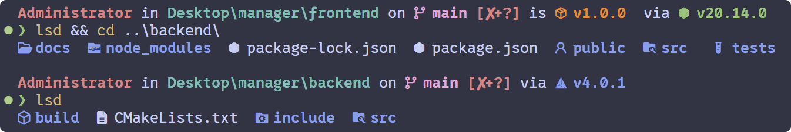
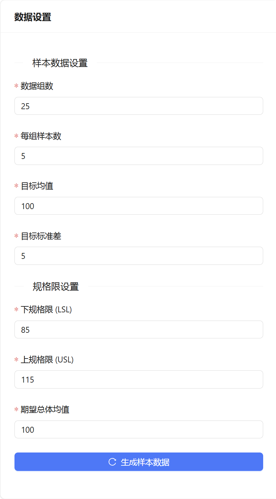
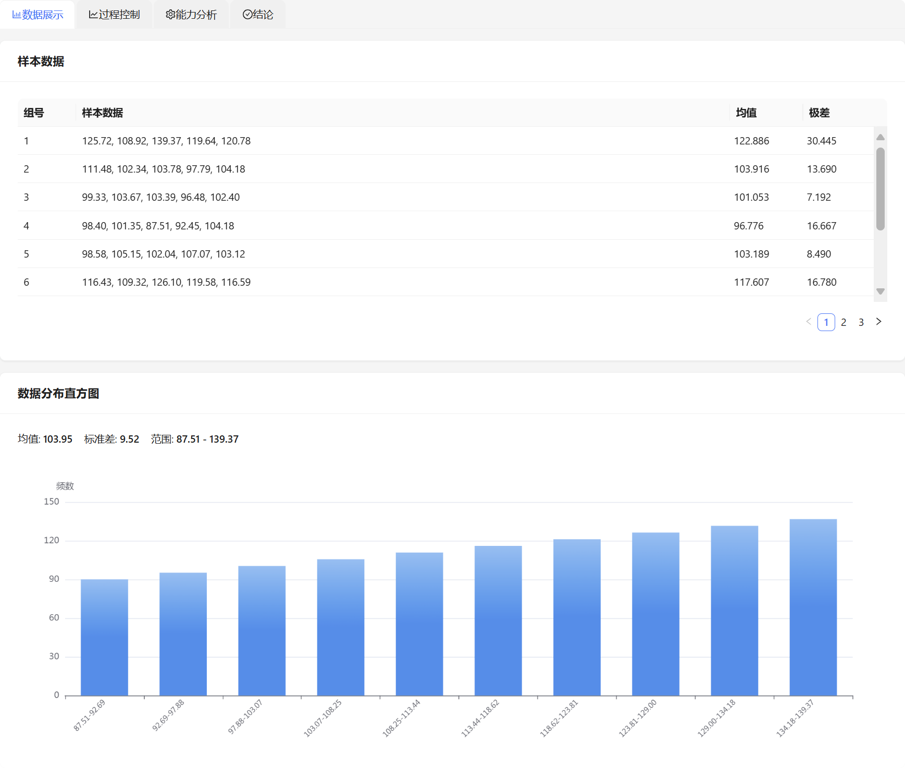
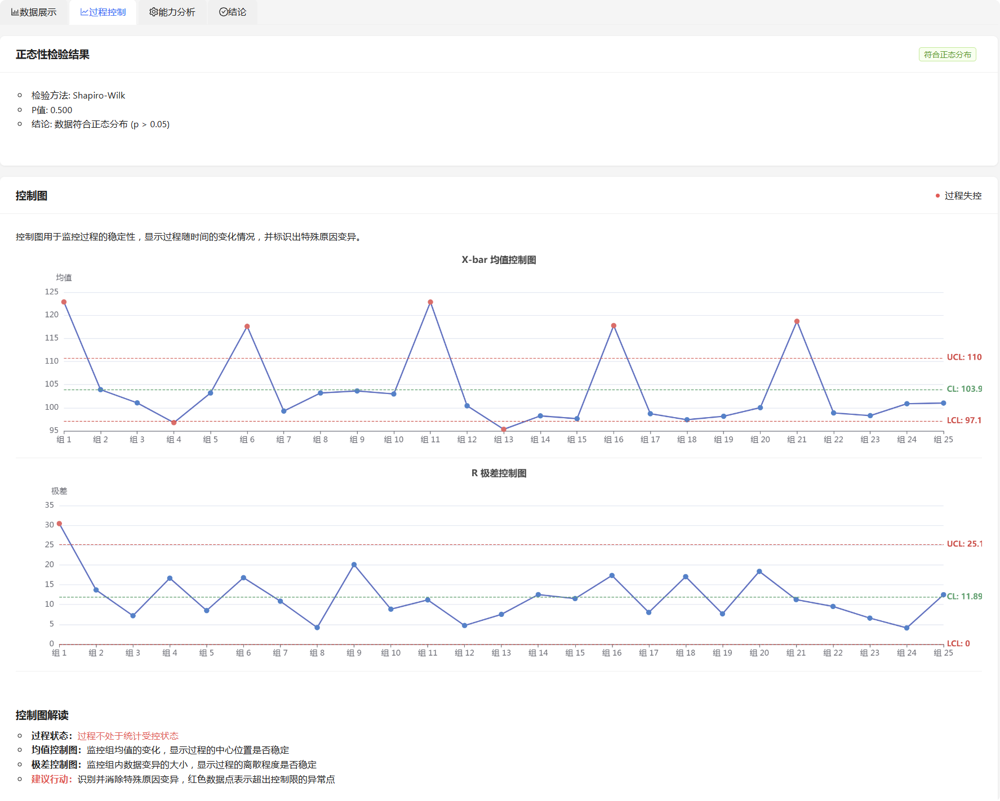
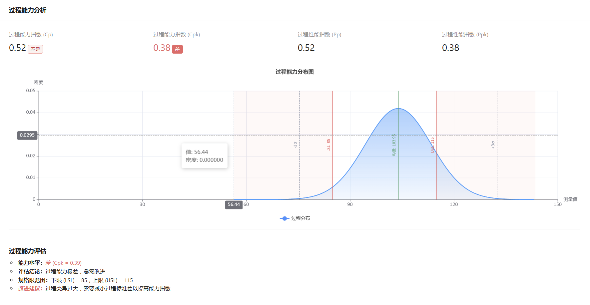

# 🌟 产品质量管理系统

## 📋 项目概述

本系统是一个完整的产品质量管理解决方案，集成了数据采集、统计分析、过程控制和能力评估等功能，帮助用户监控和改进生产过程质量。系统通过直观的图表和动态的动画效果，使质量数据易于理解和分析。

适用于制造业、服务业以及研发部门的质量监控与改进工作，特别适合需要符合ISO 9001、IATF 16949等质量管理体系要求的组织。

### 系统特点

- **统计学基础**: 基于可靠的统计学方法，提供客观的数据分析
- **可视化展示**: 采用现代化图表与动画效果，使数据分析直观明了
- **前后端分离**: 采用C++后端和TypeScript/React前端的架构设计
- **高性能计算**: 优化的统计算法，支持大量数据的快速处理
- **开放源代码**: 完全开源，允许自由定制和扩展

## 🎯 项目要求

本产品质量管理项目旨在满足以下核心要求：

1. **📊 数据收集**:
   - 收集实际数据或生成模拟数据
   - 要求25组以上数据，每组至少5个样本
   - 支持数据导入和生成功能

2. **📈 描述性统计分析**:
   - 计算关键统计指标：均值、方差、标准差、极差
   - 生成数据分布直方图
   - 分析整体和分组数据特征

3. **🔍 统计检验**:
   - 执行数据正态性检验
   - 进行总体均值检验
   - 评估数据的统计特性

4. **⚙️ 过程能力分析**:
   - 计算工序能力指数(Cp, Cpk)
   - 计算过程性能指数(Pp, Ppk)
   - 评估过程满足规格要求的能力

5. **📉 控制图分析**:
   - 绘制均值控制图(X-bar图)
   - 绘制极差控制图(R图)
   - 识别特殊原因变异

6. **📝 结论输出**:
   - 评估工艺水平状况
   - 判断生产过程是否处于统计受控状态
   - 提供改进建议

## 🏗️ 系统架构



系统采用前后端分离架构：

- **后端核心**: 使用C++开发的高性能统计分析引擎
  - 基于CMake构建系统
  - 使用nlohmann/json处理数据交互
  - 模块化设计，便于扩展新功能

- **前端界面**: 使用TypeScript和React框架构建
  - 采用Flexbox响应式布局
  - 集成ECharts实现专业统计图表
  - 使用Framer Motion实现流畅动画效果

- **部署方案**: 提供Docker容器化支持
  - 包含前后端Docker镜像
  - 使用docker-compose简化部署
  - 支持CI/CD自动化流程

## 🚀 功能模块

### 1. 📊 数据管理模块

- **数据生成**: 支持根据参数生成模拟数据，用于系统测试和教学演示
- **数据导入**: 支持从CSV、Excel等格式导入实际生产数据
- **数据存储**: 内置数据缓存机制，支持会话间数据保留
- **数据验证**: 自动检查数据完整性和有效性

### 2. 📈 统计分析模块

- **描述性统计**: 计算均值、标准差、方差、极差等基本统计量
- **正态性检验**: 使用Shapiro-Wilk检验评估数据分布是否符合正态分布
- **均值检验**: 进行t检验，验证样本均值与目标值的差异是否显著
- **直方图分析**: 生成数据分布直方图，直观展示数据特征

### 3. ⚙️ 过程控制模块

- **控制图生成**: 自动生成X-bar（均值）和R（极差）控制图
- **控制限计算**: 基于数据计算控制上下限，识别过程波动
- **特殊模式识别**: 识别控制图中的特殊模式，如趋势、循环、紧束等
- **异常点标识**: 自动高亮显示超出控制限的数据点

### 4. 📐 能力分析模块

- **能力指数计算**: 计算Cp、Cpk、Pp、Ppk等过程能力指数
- **DPMO估计**: 估算百万机会缺陷数，评估Sigma水平
- **能力评估**: 根据能力指数自动评估过程能力等级
- **改进建议**: 基于分析结果生成针对性的改进建议

## 🛠️ 技术栈

### 后端技术

- **编程语言**: C++ 17
- **构建工具**: CMake 3.10+
- **依赖管理**: CMake内置依赖管理
- **JSON处理**: nlohmann/json库
- **容器化**: Docker

### 前端技术

- **编程语言**: TypeScript 4.5+
- **框架**: React 17+
- **状态管理**: Redux
- **UI组件**: Material-UI
- **图表库**: ECharts 5+
- **动画效果**: Framer Motion
- **构建工具**: Webpack 5

### DevOps工具

- **版本控制**: Git
- **CI/CD**: GitHub Actions
- **容器编排**: Docker Compose
- **代码质量**: ESLint, clang-format

## ⚙️ 安装与部署

### 方法一: Docker部署（推荐）

1. 克隆代码库:
   ```bash
   git clone https://github.com/yourusername/quality-management-system.git
   cd quality-management-system
   ```

2. 使用Docker Compose启动:
   ```bash
   docker-compose -f docker/docker-compose.yml up -d
   ```

3. 访问应用:
   ```
   http://localhost:3000
   ```

### 方法二: 手动构建

#### 后端构建

1. 安装依赖:
   ```bash
   # Ubuntu/Debian
   sudo apt-get install build-essential cmake
   
   # Windows (使用Visual Studio开发者命令提示符)
   # 确保已安装CMake和Visual Studio
   ```

2. 构建后端:
   ```bash
   cd backend
   mkdir build && cd build
   cmake ..
   cmake --build . --config Release
   ```

3. 运行后端服务:
   ```bash
   # Linux/macOS
   ./quality_management_server
   
   # Windows
   quality_management_server.exe
   ```

#### 前端构建

1. 安装Node.js环境 (14.0+)

2. 安装依赖:
   ```bash
   cd frontend
   npm install
   ```

3. 开发模式运行:
   ```bash
   npm start
   ```

4. 生产环境构建:
   ```bash
   npm run build
   ```

## 🧪 持续集成

项目使用GitHub Actions实现CI/CD流程:

- **代码质量检查**: 自动运行ESLint和clang-format检查代码规范
- **单元测试**: 自动运行后端C++单元测试和前端React组件测试
- **自动构建**: 每次提交自动构建前后端代码
- **Docker镜像**: 自动构建并推送Docker镜像到DockerHub
- **部署流程**: 支持自动部署到测试/生产环境

## 📊 项目演示

### 数据生成界面


### 统计分析界面


### 控制图界面


### 能力分析界面


## 📈 实际应用案例

### 1. 🏭 制造业精密零件质量控制
某汽车零部件制造商使用本系统监控关键尺寸参数，通过控制图及时发现异常工艺波动，Cpk指数从0.9提升至1.5，显著减少了不合格品率。

### 2. 💼 客户服务响应时间监控
某客服中心使用本系统分析客户响应时间数据，识别出服务波动的模式，通过针对性改进措施，将平均响应时间缩短30%，客户满意度提升15%。

### 3. 🔬 新产品研发测试结果分析
某电子产品研发部门使用本系统分析prototype测试数据，通过能力分析确定了设计参数的最优区间，减少了50%的设计迭代次数。

## 📜 许可证

本项目采用[MIT许可证](LICENSE)。您可以自由使用、修改和分发本软件，但需保留原始版权和许可声明。

## 👥 团队成员

Only Waya

## 📞 联系方式

- **项目仓库**: [GitHub](https://github.com/Wang-Yang-source/quality-management-system)
- **问题反馈**: [Issue Tracker](https://github.com/Wang-Yang-source/quality-management-system/issues)
- **邮件联系**: lespuavres@gmail.com